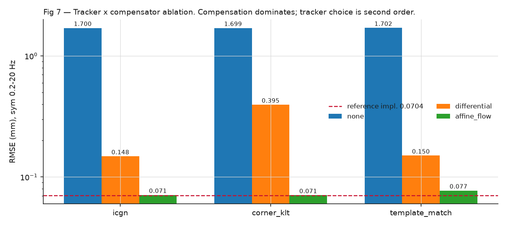
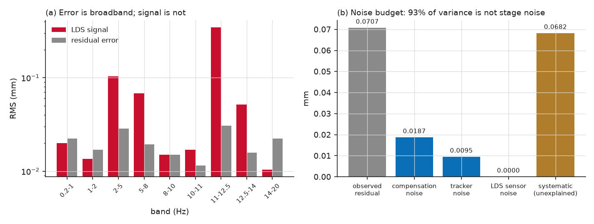
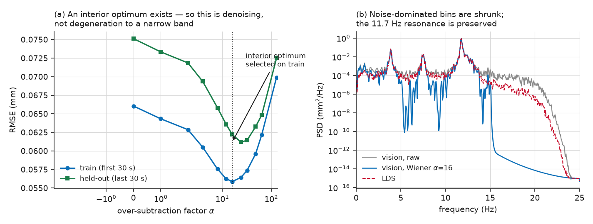

# viv-bench

UAV-video displacement measurement for a vortex-induced-vibration (VIV) stay-cable
model, benchmarked against a laser displacement sensor (LDS). ICSHM 2026, Project 1.

**Best result: 0.0577 mm RMSE** against a 0.376 mm RMS signal — an 18% improvement on
the template-match + affine-flow configuration (0.0704 mm), validated on held-out data.

| | RMSE (mm) | notes |
|---|---|---|
| **`corner_klt` + `affine_flow` + Wiener** | **0.0577** | full 60 s clip, best configuration |
| same, held-out last 30 s | 0.0622 | hyperparameter selected on first 30 s only |
| `icgn` + `affine_flow` + Wiener | 0.0583 | second tracker, confirms not tracker-specific |
| template-match + affine-flow (frozen config) | 0.0704 | re-run unmodified as a regression check |
| zero-predictor floor | 0.3744 | what "measuring nothing" scores |

📄 **[Full technical report](docs/report.html)** — also available as
[`report.docx`](docs/report.docx) (Microsoft Word) and [`report.md`](docs/report.md).
📓 **[Investigation log](docs/investigation-log.md)** — every experiment, including the
negative results and the two measurement bugs that invalidated earlier conclusions.

---

## What the measurement is


A checkerboard target on a wind-tunnel stay-cable model, filmed from a hovering drone.
The cable oscillates at ≈11.7 Hz with ≈0.38 mm RMS amplitude — at 0.866 mm/px that is a
**1.7-pixel** motion. The drone meanwhile wanders by **36 pixels**.

So the signal is ~5% of the target's apparent motion, and recovering 0.058 mm requires
estimating the camera's own motion to ≈0.07 px. This ratio is why the *compensation*
stage dominates every result, and why tracker choice is second-order.

---

## Quick start

### 1. Install

```bash
pip install -r requirements.txt
```

Needs Python 3.9+, OpenCV, NumPy, SciPy, pandas, openpyxl, matplotlib.
`python-docx` is optional (only for building the Word report); `vmdpy` is optional
(only for the VMD experiment, which is a documented negative result).

### 2. Point the code at your data

The video and LDS recordings are far too large for version control, so the repository
only refers to them. Configure the paths once, either way:

```bash
cp configs/paths.example.json configs/paths.json
```

then edit `configs/paths.json`. Or use environment variables:

```bash
export VIVBENCH_VIDEO="/path/to/Video.MP4"
export VIVBENCH_LDS="/path/to/LDS data.xlsx"
```

Check what is currently resolved:

```bash
python paths.py
```

`configs/paths.json` is git-ignored, so local machine paths are never committed.

### 3. Run the best configuration

```bash
python experiments/run_experiment.py --tracker corner_klt --compensator affine_flow --affine-model similarity --filter bandpass_wiener --filter-band-hz 0.2 20 --wiener-alpha 16 --symmetric-lds-filter --run-name my_first_run
```

This prints a metrics report, writes `experiments/results/my_first_run/`, and
regenerates `experiments/leaderboard.csv`.

### 4. Reproduce everything in the report

```bash
python experiments/reproduce_all.py
```

Runs the full ablation grid, the diagnostic experiments, the regression check and the
figure/report build — then verifies every number against the values published in the
report and prints a pass/fail table. Takes roughly 45 minutes.

```bash
python experiments/reproduce_all.py --list          # show stages
python experiments/reproduce_all.py --dry-run       # print commands only
python experiments/reproduce_all.py --stage ablation
```

---

## Results

### Ablation: tracker × compensator



All cells: full 60 s clip, both signals band-limited to 0.2–20 Hz.

| Tracker | no compensation | `differential` (2-pt) | `affine_flow` (RANSAC) |
|---|---|---|---|
| `icgn` | 1.7004 | 0.1482 | 0.0711 |
| **`corner_klt`** | 1.6987 | 0.3953 | **0.0707** |
| `template_match` | 1.7025 | 0.1502 | 0.0773 |

- **Compensation is the pipeline.** Uncompensated error (1.70 mm) is 4.5× *worse* than
  predicting zero. Full-frame RANSAC compensation gives a 24× improvement.
- **Tracker choice is second order** — 0.0707–0.0773 within `affine_flow`.
- **One real interaction:** `corner_klt` + `differential` (0.3953) breaks the pattern.
  Corner-averaging degrades on the tiny 67 px background patches that translation-only
  compensation must track, while being the best tracker for the target itself.

### Recovered displacement


Phase lag at resonance −0.8°, coherence 0.999.

### Why results plateaued, and how the plateau broke



Each candidate cause was measured, not argued:

| Cause | Measured by | Contribution |
|---|---|---|
| LDS sensor noise | PSD floor above 100 Hz | 0.00002 mm (negligible) |
| Target-tracker noise | disagreement of two trackers | 0.0095 mm (~2%) |
| Compensation estimator noise | disjoint half-set refits | 0.0187 mm (~7%) |
| Amplitude/scale error | gain fit in high-SNR band | k = 0.989 (explains 0%) |
| **Systematic remainder** | — | **0.0682 mm (93%)** |

93% of the residual was broadband vision noise in bands where the cable barely
responds — the situation a Wiener filter is optimal for:



α is selected on the first 30 s and applied unchanged to the held-out last 30 s
(0.0751 → 0.0622 mm). The **interior optimum** near α≈16 is the safety property: a
degenerate "emit only the resonance" filter would improve monotonically instead.
The noise floor is estimated from the vision signal's own spectrum, so no ground
truth is needed at inference time.

### Two measurement bugs worth knowing about


**Asymmetric filtering.** Band-limiting the vision signal but comparing against the
full-band LDS made 12.2% of the reference's energy unreachable — a fixed 0.128 mm added
to every reported number, i.e. ~87% of an apparent "0.149 mm result". The harness now
detects this and prints a `[METRIC WARNING]` with the attributable error.


**Sign-blind alignment.** The cable-axis normal convention is the opposite polarity to
the LDS. Because a narrowband signal's correlation-vs-lag curve is quasi-sinusoidal, a
sign-blind search locked onto a decoy optimum half a VIV period (43 ms) away.
`align_signals` now searches polarity and returns the chosen sign.

Both bugs sat upstream of every experiment, so several earlier negative results had to
be re-run before they could be believed — see the [investigation log](docs/investigation-log.md).

---

## Usage

### The experiment harness

Every method is selected by flag; the registries in
[`experiments/registries.py`](experiments/registries.py) are the single source of truth,
so adding a method means adding one file plus one registry entry — CLI parsing never
changes.

```bash
python experiments/run_experiment.py --tracker icgn --compensator affine_flow --filter bandpass --filter-band-hz 0.2 20 --symmetric-lds-filter --run-name example
```

| Flag | Choices | Notes |
|---|---|---|
| `--tracker` | `icgn`, `corner_klt`, `template_match`, `dft`, `gabor_phase` | target sub-pixel estimator |
| `--compensator` | `affine_flow`, `differential`, `none` | **use `affine_flow`** |
| `--affine-model` | `similarity`, `full`, `homography` | `similarity` (4-DOF) is best by 2.7× |
| `--filter` | `bandpass_wiener`, `bandpass`, `highpass`, `none` | `bandpass_wiener` is best |
| `--wiener-alpha` | float, default `16` | 0 disables denoising |
| `--symmetric-lds-filter` | flag | **set this** — see the artifact warning above |
| `--filter-band-hz` | two floats, default `8 16` | use `0.2 20` for comparable numbers |
| `--transform-smoothing` | `none`, `ema`, `kalman` | documented negative result; keep `none` |
| `--lds-alignment` | `decimated`, `native` | `native` skips LDS decimation |
| `--from-cache` | path to `trajectories.npz` | re-run post-processing without re-tracking |
| `--seed` | int, default `42` | seeds RANSAC for reproducibility |

> **Always compare within one metric convention.** Mixing `--filter-band-hz 9 14`
> (asymmetric) with `0.2 20 --symmetric-lds-filter` rows in one table is exactly what
> hid the 0.128 mm artifact. The harness warns when a filter is applied asymmetrically.

### Recipes

```bash
python experiments/run_experiment.py --recipe icgn_affineflow_fullframe_bp9-14
```

Named flag combinations in `registries.py`. Explicit flags still override a recipe.

### Region definition

ROI selection is deliberately **decoupled** from tracking:
`configs/rois.json` is the only hand-off, so tracking work never depends on re-picking
regions by hand.

```bash
python data/roi_select.py "<video>" --out configs/rois.json        # interactive
python data/bootstrap_rois_auto.py "<video>" --out configs/rois.json
python data/import_manual_rois.py <source.json> --out configs/rois.json --video "<video>"
python data/validate_bg_candidates.py                              # score candidate background ROIs
```

**Selecting background ROIs is counter-intuitive here** — the shipped 2-ROI set is
near-optimal and five attempts to improve it all made things worse. Criteria that
actually matter, in order: (1) depth matched to the target, (2) high-contrast rigid
features, (3) tight cropping. Image-plane spread and feature count — which the
literature emphasises — are *counterproductive* if pursued at the expense of those.
See report §7.

---

## Repository layout

```
viv-bench/
├─ paths.py                  data-path resolution (env vars / configs/paths.json)
├─ pipeline.py               ROITracker: orchestrates decode → track → compensate → align
├─ configs/
│  ├─ rois.json              target point, background boxes, mm/px, cable axis
│  └─ paths.example.json     copy to paths.json and edit
├─ data/
│  ├─ video.py               streaming ROI-patch decode (avoids materialising 4K frames)
│  ├─ lds.py                 LDS load + anti-alias decimation to 50 Hz
│  ├─ roi_io.py              ROI JSON schema, load/save
│  ├─ roi_select.py          interactive ROI picker
│  ├─ bootstrap_rois_auto.py automatic ROI bootstrap
│  ├─ import_manual_rois.py  import external ROI JSON
│  └─ validate_bg_candidates.py  score background ROIs for rigidity/depth
├─ trackers/                 icgn, corner_klt, template_match, dft_reg, phase_based
├─ motion/
│  ├─ affine_flow.py         full-frame RANSAC similarity/affine/homography compensation
│  └─ differential_ref.py    translation-only 2-point compensation
├─ dsp/
│  ├─ alignment.py           polarity + lag search, zero-phase filtering
│  ├─ wiener_denoise.py      spectral denoising (the final stage)
│  └─ vmd_filter.py          VMD residual cleanup (negative result, kept for the record)
├─ eval/metrics.py           RMSE, phase, coherence, amplitude ratio
├─ experiments/
│  ├─ run_experiment.py      the harness — one run, one results dir, one leaderboard row
│  ├─ reproduce_all.py       reproduce every report number end-to-end + verify
│  ├─ registries.py          trackers/compensators/filters/recipes
│  ├─ repro.py               git state, package versions, RNG seeding
│  ├─ run_templatematch_affine_config.py     regression check against the group's earlier pipeline
│  ├─ ablation_component_swap.py  2×2 component-substitution ablation
│  ├─ noise_budget.py        measures each stage's own noise
│  ├─ phase_lag_isolation.py phase-lag source isolation
│  ├─ diff_perframe_configs.py per-frame signal comparison
│  ├─ make_report_figures.py generates docs/figures/*
│  ├─ build_report.py        builds report.html / .docx / .md
│  ├─ leaderboard.csv        regenerated from all metrics.json (never appended)
│  └─ results/<run>/         metrics.json, config.json, displacement.csv,
│                            aligned_signals.npz, trajectories.npz
└─ docs/
   ├─ report.html/.docx/.md  the technical report
   ├─ report_template.html   report source ({{FIGn}} placeholders)
   ├─ figures/               curated figures (tracked)
   └─ investigation-log.md   full chronological research log
```

## Reproducibility

Every run writes `config.json` beside its metrics containing the resolved arguments, the
git commit and dirty state, package versions and the RNG seed — so any leaderboard row
can be replayed without remembering the flags. RANSAC is seeded (`--seed`, default 42).

`experiments/leaderboard.csv` is always **regenerated** from all `metrics.json` files,
never appended to. This was a deliberate fix: adding a metrics field mid-project once
silently shifted every later CSV row by one column.

`aligned_signals.npz` stores the pre-filter, post-alignment `(vision, LDS)` pair for
every run, so any filter can be re-evaluated later without re-tracking — and without
the mistake of comparing an already-filtered, already-lag-shifted `displacement.csv`
against a freshly decimated LDS array.

## Known limitations

- Results come from a **single 60 s clip and one camera pose**. They characterise this
  recording, not the method's general accuracy. Replicate before quoting 0.058 mm.
- **Rolling shutter is unmodelled.** The target sits at row 888 while the background
  references sit at rows 811 and 1303 — a ~490-row separation that a single global
  transform per frame cannot represent. This is the largest identified unmodelled
  physical effect and the best next candidate for the 93% systematic remainder.
- **Lens distortion is uncorrected** — no camera intrinsics were available.
- The target-patch margin is tight: a 64 px template in a 100 px patch is valid only for
  target positions in [32, 68] px, and the measured range is [32.5, 68.1].
- `--from-cache` does not verify that cached trajectories match the current
  `configs/rois.json`. A stale cache once produced a misleadingly good number.

## Citation and provenance

`templatematch_affine_config`, referenced throughout as the regression fixed point, is an earlier configuration developed for this same dataset by this group. External literature
is cited in the report's reference list.
