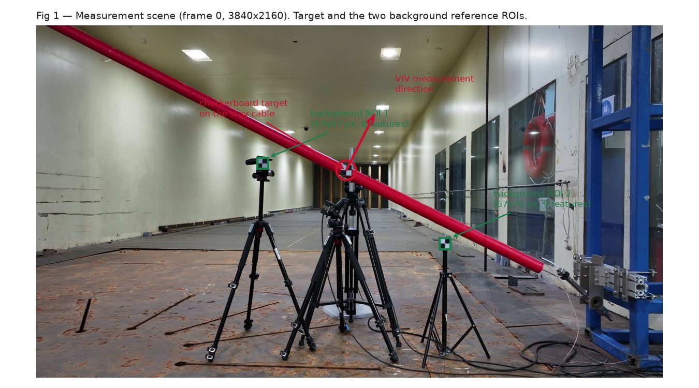
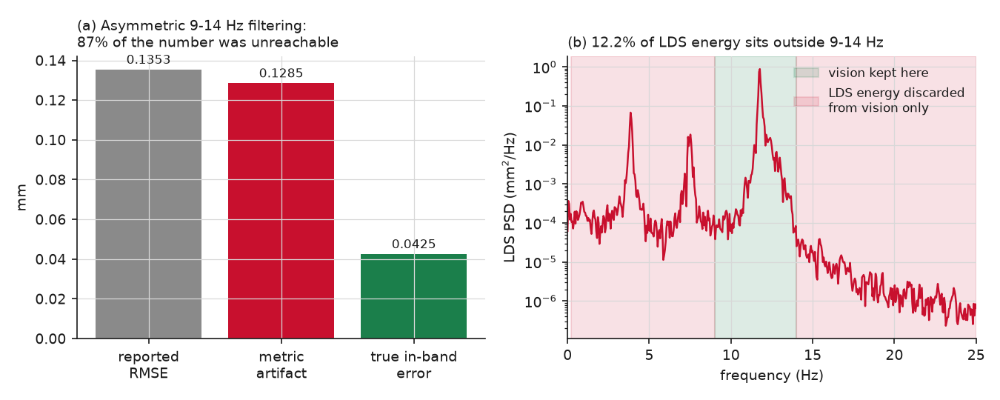
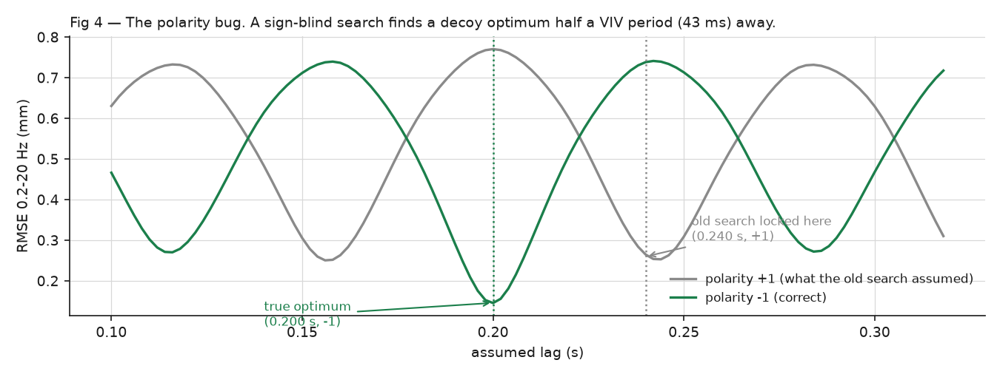
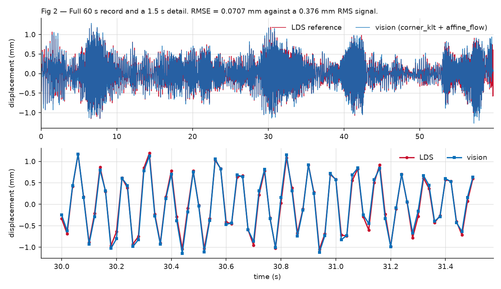

ICSHM 2026 · Project 1 · Technical Report

# Measuring a 1.7-pixel vibration from a moving drone

A complete UAV-video pipeline that recovers the vibration of a wind-tunnel stay-cable model to 0.058 mm — roughly one-fifteenth the width of a human hair — together with the two measurement mistakes that hid a factor-of-two error for most of the project's life.

60 s clip · 3840×2160 at 50 fps · 3033 frames · laser displacement sensor at 10 kHz Written for two audiences: the shaded boxes explain each idea in plain language, while the surrounding text carries the full technical detail.

Best accuracy0.0577mm · full 60 s Held-out half0.0622mm · unseen data Earlier config0.0704mm · template-match + affine Vibration size0.376mm RMS · what is measured Agreement0.999coherence at 11.7 Hz

## §0 Summary

In plain terms A steel cable in a wind tunnel shivers as air flows past it — the same effect that makes power lines hum. We filmed a small checkerboard sticker on that cable with a drone, and worked out how far the cable moved using only the video. A laser instrument measured the same movement precisely, so we could check the answer.

The catch: the cable's shiver is tiny — about 1.7 pixels in the video — while the drone itself drifts around by 36 pixels. It is like reading someone's handwriting while both you and the paper are moving. Almost all the work goes into cancelling the drone's own motion.

The final pipeline reaches 0.0577 mm RMSE against a signal of 0.376 mm RMS — an 18% improvement on the template-match + affine-flow configuration (0.0704 mm) that this project started from. Three findings carried most of the result:

1. Ego-motion compensation dominates everything. Removing the camera's own motion changes the error by a factor of 24. Which sub-pixel tracker is used changes it by 9%. Effort spent on trackers had far less return than effort spent on compensation.

1. Two measurement bugs, not method limits, produced an apparent plateau. An asymmetric filter contributed a fixed 0.128 mm to every reported number, and a sign-blind alignment search locked onto a decoy answer half a vibration cycle away. Together they made five different trackers appear to converge on the same floor.

1. The remaining error was broadband measurement noise, not a modelling error. Measuring each stage's own noise showed 93% of the residual was unexplained by any stage — the signature of a noise floor, which optimal spectral filtering then removed.

## §1 The measurement problem

What is being measured, why it matters, and why the geometry makes it hard.

In plain terms Vortex-induced vibration happens when wind blows past a cylinder — a bridge cable, a chimney, a pipeline. The air sheds small swirls alternately off each side, pushing the cable back and forth. If that rhythm matches the cable's natural frequency it resonates and, over years, can fatigue the metal. Engineers therefore need to measure how much real cables actually move.

Lasers do this accurately but must be mounted close to the structure. A drone can fly to any cable on a bridge — if the video can be made accurate enough. That is what this project tests.

*Figure 1 — The measurement scene. Frame 0 at full 3840×2160 resolution. The checkerboard target sits on the red stay cable; vibration is measured along the direction perpendicular to the cable axis. The two background reference regions are small (67×67 px) and yield only 8 and 9 trackable corner features between them — which turns out to be a deliberate virtue rather than a limitation (§7).*

The cable oscillates at about 11.7 Hz with roughly 0.376 mm RMS amplitude. At the measured image scale of 0.866 mm per pixel, that is a motion of about 1.7 pixels. Over the same 60 s the drone's apparent motion spans 36 pixels.

So the quantity of interest is about 5% of the target's apparent motion; the other 95% is camera movement that must be estimated and removed. Reaching 0.058 mm means recovering the camera's motion to about 0.07 px — roughly 0.2% of its excursion. This ratio, far more than any algorithm choice, is what makes the problem hard, and it is why the compensation stage dominates every result below.

| Channel | Rate | Length | Notes |
|---|---|---|---|
| UAV video | 50 fps | 3033 frames | 3840×2160, rolling-shutter CMOS sensor |
| Laser displacement sensor | 10 000 Hz | 600 000 samples | single axis, 0.376 mm RMS |
| Checkerboard target | — | 65×62 px | 55 mm physical size, giving 0.866 mm/px |

Measured, not assumed The laser reference is not the limiting factor. Its noise floor, read from the power spectrum above 100 Hz (1.6×10⁻¹¹ mm²/Hz), is equivalent to 0.00002 mm across the 0.2–20 Hz comparison band — about 3500× smaller than the residual error. Every error discussed in this report originates in the video pipeline.

## §2 How the pipeline works

Seven stages. Region selection is deliberately separated from tracking, so algorithm work never depends on re-picking regions by hand.

In plain terms The pipeline answers one question per stage: where is the sticker in this frame? → how much of that movement was the drone? → subtract it → convert pixels to millimetres → line the result up in time against the laser → clean up the leftover noise.

Region definition configs/rois.json → data/roi_io.py The target point, the background reference boxes, the millimetres-per-pixel scale and the cable-axis direction are stored as a small JSON file.

Why it matters: this file is the only hand-off between choosing regions and everything downstream, which is what allows every tracking method to be re-run and compared without touching the regions.

Streaming video decode data/video.py — load_roi_patches() Small image patches around each region are cropped during a single decode pass rather than loading whole frames into memory.

Why it matters: holding the entire 4K clip in memory needed about 23 GB. Cropping during decode removes that limit entirely.

Sub-pixel target tracking trackers/ — icgn · corner_klt · template_match · dft_reg · phase_based Five interchangeable estimators behind one interface. IC-GN[9] is the digital-image-correlation standard; corner-KLT averages pyramidal Lucas–Kanade optical flow[10] over many corners; template matching uses normalised cross-correlation with sub-pixel peak refinement; a Gabor quadrature-filter tracker was added specifically because correlation-peak estimators suffer a documented bias toward whole-pixel positions.

Plain version: five different ways to answer "which pixel — and what fraction of a pixel — is the sticker at now?"

Ego-motion compensation motion/affine_flow.py · motion/differential_ref.py The decisive stage. The affine-flow method detects corner features in the background regions, tracks them across full frames, and fits one global 4-degree-of-freedom similarity transform per frame using RANSAC[12] to reject bad matches; the target position is then inverse-warped by that transform. The differential method is a cheaper translation-only alternative that subtracts the mean motion of two background points.

Plain version: watch things known to be stationary, work out how the camera moved, and undo exactly that motion on the target.

Projection and scaling pipeline.py The stabilised 2-D track is projected onto the direction perpendicular to the cable axis, then multiplied by the millimetres-per-pixel scale.

Why it matters: this collapses a 2-D track onto the same single axis the laser measures, so the two can be compared directly.

Temporal alignment dsp/alignment.py — align_signals() The camera and laser clocks run independently, so the two records must be aligned in time. A coarse stage correlates the signals' amplitude envelopes (robust but low-precision), a fine stage refines to sub-sample precision, and both signal polarities are searched.

Omitting that last step was the single most expensive bug in the project — see §4.

Spectral denoising dsp/wiener_denoise.py A graded per-frequency Wiener gain[11] attenuates the frequency bins dominated by measurement noise while leaving the resonance untouched. The noise level is estimated from the video signal's own spectrum, so no reference sensor is required.

Plain version: the cable only really moves at a few known rhythms, so anything measured at other rhythms is mostly noise and can be turned down.

## §3 Ablation: what actually matters

Every cell uses the full 60 s clip with both signals band-limited to 0.2–20 Hz — one evaluation convention throughout, so the numbers are mutually comparable.

In plain terms An ablation switches each part of the system off, or swaps it for an alternative, to see how much that part was contributing. Lower numbers are better; they are the typical error in millimetres.

*Figure 7 — Tracker and compensator ablation. Logarithmic scale. Compensation choice spans a factor of 24; tracker choice spans 9% within the best compensator. The dashed line marks the earlier template-match + affine-flow configuration, re-run unmodified.*

| Target tracker | No compensation | Translation-only (2 points) | RANSAC similarity (full-frame) |
|---|---|---|---|
| IC-GN | 1.7004 | 0.1482 | 0.0711 |
| corner-KLT | 1.6987 | 0.3953 | 0.0707 |
| template matching | 1.7025 | 0.1502 | 0.0773 |

Three conclusions follow directly:

- Compensation is the pipeline. Without it the error (1.70 mm) is 4.5× worse than simply predicting no movement at all. With full-frame RANSAC compensation it is 0.071 mm — a 24× improvement, and 2–5× better than translation-only.

- Tracker choice is second order. Within the best compensator the three trackers span 0.0707–0.0773 mm.

- One interaction is real. corner-KLT with translation-only compensation (0.3953 mm) breaks the pattern. Corner-averaging degrades badly on the tiny 67 px background patches that translation-only compensation must track, while being the best tracker for the target itself. Tracker and compensator cannot be chosen independently.

## §4 Two measurement bugs

For most of this project the pipeline appeared to plateau at 0.150 mm, immovably, across five different trackers. Both causes lay in how results were measured, not in the methods themselves.

In plain terms Both bugs were in the scoring, not the measuring — like a stopwatch that always adds four seconds. Every runner looks equally slow, and no amount of training improves the time, because the fault is in the clock.

### Bug A — the asymmetric-filter artifact

The long-standing default filtered the video signal to keep only 9–14 Hz but compared it against the unfiltered laser signal. 12.2% of the laser signal's energy lies outside that band, and the video signal had been filtered to contain exactly zero there. Because the two frequency ranges are orthogonal, the reported error decomposes exactly:

*RMSE² = (out-of-band laser energy)² + (true in-band error)²0.1491² = 0.1283² + 0.0754² Figure 3 — 87% of the headline number was unreachable. The artifact term is a constant that no tracker, compensator or amount of tuning could move — which is precisely why five independent methods appeared to converge on the same floor. They were all measuring the same constant. The harness now computes this term and prints a warning whenever a filter is applied asymmetrically.*

### Bug B — a sign-blind alignment search

The cable-axis normal convention (normal forced to point "up") is the opposite polarity to the laser sensor's sign convention. The alignment stage searched only for time lag, never for polarity. For a narrowband 11.7 Hz signal the correlation-versus-lag curve is itself roughly sinusoidal, so a polarity-flipped signal correlates almost as well at a lag half a vibration period away (about 43 ms) as the true signal does at the true lag. The search locked onto that decoy on every run.

In plain terms The video measured the movement upside-down relative to the laser. Because the motion repeats every 85 milliseconds, an upside-down copy shifted by half a cycle looks almost identical to the correct one — so the software confidently picked the wrong match.

*Figure 4 — The decoy optimum. A half-period shift is a mild phase error at 11.7 Hz but a severe one at 2–5 Hz, which is why the damage concentrated in the low-frequency bands and masqueraded as a compensation problem. Note that the envelope-based coarse stage added earlier could not catch this: the envelope of a signal and of its negative are identical, so envelope correlation is polarity-blind by construction.*

| Quantity | Sign-blind search | With polarity search |
|---|---|---|
| Chosen lag and polarity | +0.240 s / +1 | +0.200 s / −1 |
| Error, 0.2–20 Hz | 0.2648 | 0.1456 |
| Error, 2–5 Hz | 0.1841 | 0.0277 |
| Error, 9–14 Hz | 0.0710 | 0.0352 |

Consequence for earlier conclusions Both bugs sat upstream of every experiment. The reported "0.150 mm floor across five trackers" was about 87% a metric constant; a separately reported "background-tracking non-determinism" turned out to be a symptom — 0.2 px of jitter was merely enough to flip which decoy peak won the sign-blind search. After the fix, three independent tracking runs agree on the lag to four decimal places. Several negative results had to be re-run before they could be believed (§7).

## §5 Why every method plateaued at 0.070 mm

Having been wrong once about a plateau, the second one was attacked by measuring each candidate cause rather than reasoning about it.

In plain terms After the bugs were fixed, every method landed near 0.070 mm. Was that a real physical limit, or another artificial one? Each possible culprit — the laser, the tracker, the compensation, the scale calibration — was measured separately, the way an accountant traces where money went.

*Figure 5 — The error is broadband; the signal is not. (a) The laser signal is concentrated at the resonance, while the residual error is spread almost uniformly across frequency. (b) Each stage's own noise, measured by resampling that stage's inputs.*

| Candidate cause | Measured by | Contribution | Verdict |
|---|---|---|---|
| Laser sensor noise | power-spectrum floor above 100 Hz | 0.00002 mm | ruled out |
| Target-tracker noise | disagreement between two trackers | 0.0095 mm | ~2% of variance |
| Compensation estimator noise | disjoint half-set refits of the transform | 0.0187 mm | ~7% of variance |
| Amplitude or scale error | gain fit in the high-signal resonance band | k = 0.989 | explains 0% |
| Systematic remainder | — | 0.0682 mm | 93% of variance |

The compensation-noise figure comes from splitting the background features into two disjoint halves, fitting an independent transform from each, compensating the same target track with both, and differencing the results. Two independent half-set estimates differ by √2 times the half-set noise, and a half-set fit is about √2 noisier than the full fit, so σ_full ≈ rms(difference)/2. This requires no ground truth — it measures the estimator's own variance.

So the plateau was not stage noise 93% of the residual variance is not random noise from any stage. It is broadband video content in frequency bands where the cable barely responds — agreement with the laser is only 0.60–0.77 even where both signals carry real energy. That is a measurement noise floor, and, critically, it is exactly the right shape for optimal spectral filtering rather than for further tuning of the tracker or the transform.

## §6 Breaking the plateau

If the residual is broadband noise sitting beneath a narrowband signal, a Wiener filter is the textbook-optimal response — and unlike a hard frequency cut it cannot recreate the artifact of §4.

In plain terms Think of a graphic equaliser. Instead of muting whole frequency ranges — which caused Bug A — each frequency is turned down in proportion to how much of it is noise. Frequencies carrying real cable motion pass through untouched; frequencies carrying only noise are turned right down. How much is noise is judged from the video signal itself, so the laser is never needed to apply it.

G(f) = max(0, (Pvv(f) − α·Pnn) / Pvv(f)) The noise level Pnn is estimated from the video signal's own spectrum in 16–24 Hz, where the cable does not respond — so the method needs no ground truth and is deployable without a reference sensor. Nothing is hard-cut: bins dominated by signal pass essentially unchanged, while noise-dominated bins are shrunk toward zero.

*Figure 6 — A genuine interior optimum. (a) α was selected on the first 30 s alone and applied unchanged to the held-out last 30 s. Performance improves up to α≈16 then degrades again — a degenerate "keep only the resonance" filter would improve monotonically instead, so the interior optimum is the safeguard that distinguishes real denoising from a repeat of Bug A. (b) The filter preserves all three real structural modes (about 4, 7.5 and 11.7 Hz) and removes the floor between and above them.*

| Configuration | Train (first 30 s) | Held out (last 30 s) | Full 60 s |
|---|---|---|---|
| corner-KLT + RANSAC similarity | 0.0661 | 0.0751 | 0.0707 |
| + Wiener denoising (α = 16) | 0.0559 | 0.0622 | 0.0577 |
| IC-GN + RANSAC similarity + Wiener | — | 0.0620 | 0.0583 |
| template matching + RANSAC similarity (earlier configuration) | — | — | 0.0704 |

Result 0.0577 mm on the full clip, 0.0622 mm on held-out data — an 18% improvement on the earlier configuration, with the single tuning parameter chosen on training data only and the noise level estimated without ever touching the laser signal. Two independent trackers agree (0.0577 and 0.0583 mm), so the gain is not tracker-specific.

*Figure 2 — Recovered displacement against the laser reference. The detail panel spans 1.5 s at 50 Hz. Phase lag at the resonance is −0.8°, coherence 0.999.*

## §7 What did not work

Recorded because the negative results shaped the design, and because several of them reversed once the measurement was fixed.

In plain terms Most ideas tried here made things worse. Two are worth understanding because they are counter-intuitive: using more reference points made results worse, and smoothing the estimated camera motion — which sounds obviously helpful — was actively harmful.

| Method tried | Result (mm) | Why — measured, not assumed |
|---|---|---|
| Wider background regions92%×94% of frame, ~1250 features | 0.1967 | Parallax. Distant background moves only 30–50% as much as the target because it is further from the camera. A 2-D transform has no depth parameter, so a fit spanning mixed depths is correct at no depth at all. Published advice to widen the baseline[6][7] assumes rotation-dominated camera motion; this camera translates enough for parallax to dominate. |
| Depth-matched wide regions | 0.5605 | Depth matching is necessary but not sufficient — a region at the frame corner also carries the worst uncorrected lens distortion. |
| Enlarging the existing regions in place | 0.5735 | Same image position, same depth, 114 features instead of 17 — still 8× worse. Feature quality is the binding constraint: the small regions are tightly cropped onto a few high-contrast rigid corners, and enlarging admits weaker features that drag the unweighted fit. |
| Temporal smoothing of the camera transform (EMA and Kalman) | 0.209–0.808 | The background transform carries real content near the resonance; smoothing removes it. The Kalman variant is the more dangerous of the two — its backward-smoothing pass keeps phase flat while gutting amplitude, so monitoring phase alone cannot detect the damage. |
| Variational mode decomposition cleanup[8] | 0.1378 | Keeping only modes near 11.7 Hz discards real laser content. Its flattering symmetric figure (0.0351) is the §4 artifact in a new costume. |
| Ensemble and median fusion of trackers | 0.0706 | No gain, with a clear mechanism: tracker errors correlate at +0.982 because they share a compensator, so the residual is common-mode and averaging cannot cancel it. |
| 6-DOF affine and 8-DOF homography transforms | 0.1931 / 0.1280 | Extra degrees of freedom overfit two small clustered background regions. The 4-DOF similarity model is the correct choice here, by a factor of 2.7. |
| Calibration rescaling | 0.0700 | Reversed from "negligible" to a real 1–2% effect once the measurement was fixed. But an earlier −3.9% estimate was regression-diluted: fitting gain across the whole band, where out-of-band noise inflates the predictor variance, biases the slope toward zero. Only the high-signal resonance-band estimate (−1.1%) and the independent geometric measurement (−1.7%) are defensible. |

Selection criteria that actually matter for background regions In order: (1) depth matched to the target, (2) high-contrast rigid features, (3) tight cropping that excludes weaker features. Image-plane spread and feature count — which the literature emphasises — are counterproductive if pursued at the expense of those three. The two-region set in use is near-optimal for this scene.

## §8 Validation and reproducibility

- Fixed-point regression check. The frozen template-match + affine-flow configuration is driven unmodified through experiments/run_templatematch_affine_config.py and reproduces its recorded 0.07039 mm / 0.98290 correlation bit-for-bit. It is re-run after every change and has never moved — which is precisely how both bugs in §4 were caught: this number stayed put while others shifted.

- Component ablation by substitution. Swapping that configuration's target track and camera transform against the current pipeline's, in a 2×2 grid, isolated the difference unambiguously: the newer target tracking slightly outperformed it (0.0711 versus 0.0717 mm), and the entire remaining gap was compensation in the 0.2–1 Hz drift band.

- Synthetic ground truth before real data. Every estimator was validated against synthetic signals with known shift, polarity and amplitude before being trusted on real data. The polarity fix, the transform decomposition (exact to 2×10⁻¹⁶) and the alignment search were all verified this way.

- Train/test split. The one tuned parameter (α) was selected on the first 30 s and reported on the held-out last 30 s.

- Run provenance. Every run writes its resolved arguments, git commit and dirty state, package versions and random seed alongside its metrics, so any table row can be replayed without remembering the flags.

- One-command reproduction. python experiments/reproduce_all.py re-runs the entire ablation, the diagnostics, the regression check and the figure/report build, then verifies every number in this report and prints a pass/fail table. The current worst deviation across all 17 published values is 0.07%.

Known limitations Results come from a single 60 s clip and a single camera pose, so they characterise this recording rather than the method's general accuracy. Rolling-shutter distortion is unmodelled: the target sits at image row 888 while the reference regions sit at rows 811 and 1303, a separation of about 490 rows that a single global transform per frame cannot represent. Lens distortion is uncorrected — no camera intrinsics were available. The target-patch margin is also tight: a 64 px template inside a 100 px patch is valid only for target positions in [32, 68] px, and the measured range is [32.5, 68.1] px.

### Recommended next steps

1. Quantify rolling shutter. The largest identified unmodelled physical effect, and the most likely contributor to the 93% systematic remainder. A row-dependent timing term can be tested before adding model complexity.

1. Depth-weighted or split ego-motion estimation. Estimate rotation from distant features (which is depth-independent) and translation from depth-matched features. This is the principled version of the region experiments that failed in §7.

1. Replicate across clips and camera poses before quoting 0.058 mm as a general accuracy figure.

1. Deep-learning trackers are de-prioritised: the ablation shows classical sub-pixel target tracking already matches or beats the earlier configuration, so the available headroom is not in the tracker.

## §9 Glossary

Terms used above, in plain language.

**Vortex-induced vibration (VIV)**

> Wind flowing past a cylinder sheds swirls alternately from each side, pushing it back and forth. If that rhythm matches the structure's natural frequency it resonates, which over years can fatigue the material.

**RMSE (root-mean-square error)**

> The typical size of the disagreement between the video measurement and the laser's, in millimetres. Smaller is better. For scale, the vibration itself is 0.376 mm RMS.

**Sub-pixel tracking**

> Estimating position to a fraction of a pixel by using the smooth variation of brightness around a feature, rather than snapping to the nearest whole pixel.

**Ego-motion compensation**

> Working out how the camera moved, using things known to be stationary, and subtracting it so only the target's true motion remains.

**Optical flow**

> Estimating how each small patch of the image moved from one frame to the next.

**RANSAC**

> A way to fit a model when some measurements are badly wrong: it repeatedly fits to random subsets and keeps the fit that most measurements agree with, so a few bad matches cannot dominate.[12]

**Similarity transform (4-DOF)**

> A description of camera movement allowing shift, rotation and uniform zoom — four numbers. Richer models (6-DOF affine, 8-DOF homography) also allow stretch and perspective, but performed worse here by overfitting.

**Parallax**

> Nearby objects appear to move more than distant ones when the camera shifts sideways. It is why background regions at the wrong distance actively harm the result.

**Power spectrum**

> How much of a signal's energy sits at each frequency — the signal's "recipe" of rhythms.

**Coherence**

> How consistently two signals agree at a given frequency, from 0 (unrelated) to 1 (perfectly related). Here it is 0.999 at the vibration frequency.

**Wiener filter**

> The mathematically optimal way to turn down noise when you know roughly how much noise sits at each frequency — a graded equaliser rather than an on/off cut.[11]

**Rolling shutter**

> Most video sensors expose the image one row at a time rather than all at once, so different parts of a moving scene are captured at slightly different instants.

**Held-out data**

> A portion of the recording deliberately not used while tuning, kept back to check that the result is genuine rather than fitted to the data used for tuning.

## §10 References

1. Sun, L. et al. A two-stage correction method for UAV movement-induced errors in non-target computer vision-based displacement measurement. Mechanical Systems and Signal Processing, 2024. sciencedirect.com/science/article/abs/pii/S088832702401029X — describes the same two-stage architecture used here (similarity transform from stationary reference points, then variational mode decomposition); reports 0.12–0.49 mm mean error.

1. Experimental accuracy evaluation of UAV-based homography for static and dynamic displacement monitoring of structures. Sensors, 2026. doi.org/10.3390/s26051593 — reports vertical-displacement RMSE below 0.08 px, the same sub-pixel regime as this work.

1. Vautherin, J. et al. A two-step approach for the correction of rolling shutter distortion in UAV photogrammetry. ISPRS Journal of Photogrammetry and Remote Sensing, 2019. sciencedirect.com/science/article/abs/pii/S0924271619302849 — basis for the rolling-shutter concern raised in §8.

1. UAV-assisted vision-based vibration measurement via hybrid tracking and coarse-to-fine ego-motion compensation. Advanced Engineering Informatics, 2026. sciencedirect.com/science/article/abs/pii/S1474034626002430

1. Enhanced vision-based structural displacement monitoring through deep learning approaches. Advanced Engineering Informatics, 2025. sciencedirect.com/science/article/abs/pii/S0166361525001022

1. Aqel, M. O. A. et al. Review of visual odometry: types, approaches, challenges, and applications. arXiv:1804.11142, 2018. arxiv.org/pdf/1804.11142 — source of the field-of-view guidance that §7 shows does not transfer to translation-dominated, parallax-heavy scenes.

1. Egomotion estimation using background feature point matching in OpenCV environment. Springer, 2017. link.springer.com/chapter/10.1007/978-981-10-4852-4_22

1. Dragomiretskiy, K. and Zosso, D. Variational mode decomposition. IEEE Transactions on Signal Processing, 62(3):531–544, 2014. — the decomposition tested and rejected in §7.

1. Baker, S. and Matthews, I. Lucas-Kanade 20 years on: a unifying framework. International Journal of Computer Vision, 56(3):221–255, 2004. — the inverse-compositional Gauss–Newton formulation behind the IC-GN tracker.

1. Bouguet, J.-Y. Pyramidal implementation of the affine Lucas–Kanade feature tracker. Intel Corporation Microprocessor Research Labs, 2001. — the pyramidal optical flow used for background features and by corner-KLT.

1. Boll, S. F. Suppression of acoustic noise in speech using spectral subtraction. IEEE Transactions on Acoustics, Speech and Signal Processing, 27(2):113–120, 1979. — the over-subtraction formulation adopted in §6.

1. Fischler, M. A. and Bolles, R. C. Random sample consensus: a paradigm for model fitting with applications to image analysis and automated cartography. Communications of the ACM, 24(6):381–395, 1981. — robust transform fitting in the compensation stage.

viv-bench — UAV-video VIV displacement measurement · ICSHM 2026 Project 1 Figures generated from saved run artefacts by experiments/make_report_figures.py; archival 300 dpi TIFF copies in docs/figures/tiff/ Reproduce every number in this report with: python experiments/reproduce_all.py Generated from a single source in three formats — report.html, report.docx, report.md — by experiments/build_report.py
